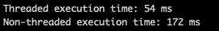
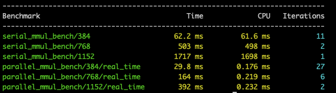

# Work-stealing Thread Pool

For our C++ (CIS 1901) Final Project, we designed a work-stealing thread pool that can result in 4-6x increases in speed, found through benchmarking. We utilize native C++ threading, synchronization techniques with mutexes and semaphores, and a thread-safe queue to manage a series of tasks. 

## Image Generation Demo

As a fun little sidequest, we've developed a script in ```examples/image_generation.cpp``` that leverages perlin noise 2D to generate realistic looking world maps. Perlin noise is a vector-based math function that generates "smooth" noise. It takes in an x-position, a y-position, and a seed and can generate values that can be mapped to colors. We use stb to generate perlin values and image generation. An example of an image generated can be seen here: 
<div align="center">
  
</div>

To apply a thread pool, we use the generation of a single row of the image as a task for a thread. We also compare against a synchronous implementation to compare for speed. The result of the benchmarking is seen here: 




## Features

- Thread-safe queue: We use mutexes and optional values to create a thread safe queue. This queue supports basic operations like ```push_front()```, ```push_back()```, ```pop_front()```, ```pop_back()``, and ```empty()```
- Thread pool: Our thread pool is the central object that manages threads, enqueued tasks, and work stealing. Threads and tasks are managed in a vector, and we also use a vector of semaphores to control the runtime of each thread. When  ```enqueue_task``` is called, the thread pool will randomly assign this task to any thread, which will "wake up" the thread if that thread is sleeping. Each thread has its own queue of tasks, which they will individually work through until completion. When a thread finishes its tasks, it will try iterating through other threads and pop off a task off the back of any other thread's queues. The destructor is typically called early, but will wait for all thread execution to terminate in order to complete the destruction of the thread pool object.
- Benchmarking: We use Google Benchmarking to compare our thread pool against synchronous executions. As an example, we use larger matrix multiplication, and the results of the benchmarking can be seen here: 




## Installation

Step-by-step series of explanations about how to install this library.

Prerequisites: 

- g++
- CMake
- Make
- Google Benchmarking

The repo can be cloned with: 

```bash
git clone https://github.com/rm03/thread-pool.git
```

Google benchmarking can be installed (system-wide) like this: 

```bash
git clone https://github.com/google/benchmark.git
cd benchmark
mkdir build && cd build
cmake -DCMAKE_BUILD_TYPE=Release -DBENCHMARK_DOWNLOAD_DEPENDENCIES=ON -DBENCHMARK_ENABLE_GTEST_TESTS=OFF ..
make
sudo make install
```

## Usage

Feel free to follow the code snippet below as example usage: 

```c++
#include "thread_pool.hpp"


int main() {
  {
    // instantiate the thread pool with default initialization. By default, thread count is maximized and void return-base tasks are used. 
    thread_pool pool;
  
    // Assuming that there are a set of tasks (std::function<void()> by default), you can add functions like this
    for (Task t : tasks) {
      pool.enqueue_task(t);
    }
  } // Generate a scope to force the destructor to call for pool
  return 0; 
}

```

And that's it! Feel free to templatize to any type of invocable or any number of threads. 

## Authors

1. Rohan Moniz
2. Michael Lu
